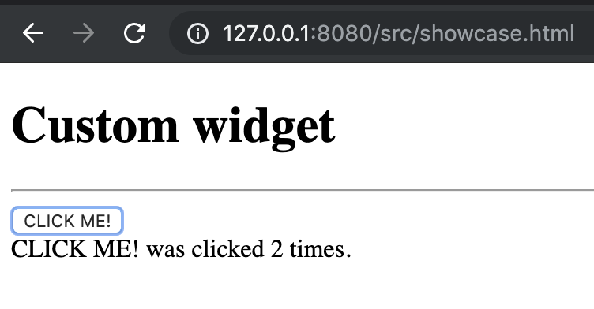

# Testing dijit widgets in nodejs with Mocha

Setting up nodejs to unit test dijit widgets is very challenging and not straight forward and there are no documentations on how to achieve this. 

This project aims to give guidances on how to accomplish this task and hit the ground running!

### Table of Contents

1. [Installation](#installation)
2. [Showcases](#showcases)
3. [Background](#background)
4. [How-tos](#how-tos)
    * [How to setup nodejs to render a dijit widget](#how-to-setup-dijit-nodejs)
    * [How to setup a nodejs test with mocha](#how-to-setup-test-nodejs)
    * [How to setup a browser test with mocha](#how-to-setup-test-browser)
5. [Licensing, Authors, and Acknowledgements](#licensing)

## Installation <a name="installation"></a>

Clone this git repository and invoke the following command at the root folder of the project

```
npm install
```

## Showcases <a name="showcases"></a>

Since this README is quite long, I listed out commands that you can use to inspect how to run and inspect Test and Source under Tests in the nodejs and browser environment.

See [How-tos](#how-tos) section for more details

### Test

#### NodeJS

See more details in [How to setup a nodejs test with mocha](#how-to-setup-test-nodejs)

```
$ npm test test/nodejs/runner.js 
```


#### Browser

See more details in [How to setup a browser test with mocha](#how-to-setup-test-browser)

```
$ npm start
```
Then navigate to the test page `http://127.0.0.1:8080/test/browser/runner.html`


### Source under Test

Source for the Widget under test can be found in [./src/js/widgets/CustomWidget.js](./src/js/widgets/CustomWidget.js)

#### NodeJS

See more details in [How to setup nodejs to render a dijit widget](#how-to-setup-dijit-nodejs)

```
$ node src/showcase_in_jsdom.js 
```

[./src/nodejs/showcase.js](./src/nodejs/showcase.js)


#### Browser

```
$ npm start
```
Then navigate to the test page `http://127.0.0.1:8080/src/showcase.html`

[./src/showcase.html](./src/showcase.html)




<hr />

## Background <a name="background"></a>


Dojo/dijit was a popular JavaScript framework in the past and there are many legacy apps that are still running with this framework. Imagine that one fine day, for whatever reason,

> *"You got a task to enhance legacy apps writen with **dojo** and **dijit** frameworks and need to add unit tests and run them in **nodejs**"*

Modern testing frameworks like Jest, Mocha, and Jasmine provide a lot of attractive features to help authoring JavaScript unit tests for your apps and run them in the nodejs environment. 

However, most documentations and examples to run tests in those frameworks in nodejs assume that your apps are developed with modern JavaScript frameworks and standards. Setting up tests to run in the nodejs environment is not a trivial task especially when there are no documentations and community support.

I spent a lot of time to figure out how to 
* Create a dijit widget in JSDom in the nodejs environment (Thanks to this old article ["Server Side Dijit"](http://jamesthom.as/blog/2013/01/15/server-side-dijit/) written by James Thamas on Jan 15th, 2013 and the dojo documentation ["Dojo and Node.js"](https://dojotoolkit.org/documentation/tutorials/1.10/node/) - Those are the only two helpful articles that I found online in July 2019 though)
* Since **dojo uses AMD** to support packaging and modules but **nodejs uses CommonJS** for its module system, we need to find a way to configure test environments such as setting up the global window object and other global variables for other required libraries such as chai (assertion library) and jQuery (for UI interaction and dom traversal)
* Reuse the same test implementation and run it in the **"browser"** and **"nodejs"** environment

and decided to put together this project in GitHub to help folks who encounter the same challenges so they can hit the ground running :)

<hr />

## How-tos <a name="how-tos"></a>

### Prerequisites
This instructions assumes you have some background knowledge of
* nodejs
* AMD system
* dojo/dijit
* mocha

<hr />

### How to setup nodejs to render a dijit widget<a name="how-to-setup-dijit-nodejs"></a>

> **RESOURCES:**
> * ["Server Side Dijit"](http://jamesthom.as/blog/2013/01/15/server-side-dijit/)
> * ["Dojo and Node.js"](https://dojotoolkit.org/documentation/tutorials/1.10/node/)

1. In order to load an AMD module under NodeJS, we need a module loader. The require() that comes default with Node.js can only load CommonJS modules. The Dojo AMD loader (as well as other loaders, like RequireJS) can be "bootstrapped" to allow you to have an "AMD environment"
    * See [./src/nodejs/config/bootstrap_dojo.js](./src/nodejs/config/bootstrap_dojo.js)
2. Specify modules to bootstrap (aka load it in the dojo environment) and specify them in the **deps** key in [dojoConfig](./src/nodejs/config/bootstrap_dojo.js)
3. Note that since **"dojo/domReady"** does not work as intended in the nodejs environment (it expects a global window object), we need to patch it (See the **#Patch** tag in [./lib_patches/dojo/domReady.js](./lib_patches/dojo/domReady.js)) and use this patch by specifying it in the **aliases** key in [dojoConfig](./src/nodejs/config/bootstrap_dojo.js)
4. In the bootstrapped module, create a window object using **JSDOM** and assign it to the global variable **window**
5. Finally, create a dijit widget in the newly created dom! (See [./src/nodejs/showcase.js](./src/nodejs/showcase.js))

#### Example
Execute the command below to see how the dom looks like:

```
$ node src/showcase_in_jsdom.js 
```

<hr />

### Source under test:

Below is a list of source that will be tested:
* CustomWidget (requires dom in some cases) [./src/js/widgets/CustomWidget.js](./src/js/widgets/CustomWidget.js)
* mathops (does not require dom) [./src/js/utils/mathops.js](./src/js/utils/mathops.js)

### How to setup a nodejs test with mocha<a name="how-to-setup-test-nodejs"></a>

1. Since mocha apis will be available globally when running tests, we don't need to import it (See [./test/twidgets_CustomWidget.js](./test/twidgets_CustomWidget.js) and [./test/tutils_mathops.js](./test/tutils_mathops.js))
    * Note that we will use the same test script when running test in **nodejs** and **browser**
2. However, to use other libraries in our tests, i.e. chai (for assertions), jQuery (for dom traversal), we need to make them available globally by importing using `"dojo/node!<package_name>"` and setting them in a global variable (See [./test/utils/setup_env.js](./test/utils/setup_env.js))
3. Similar to the previous example, we will need to setup the window object before running test. I put together all required setups in (See [./test/utils/setup_env.js](./test/utils/setup_env.js)) and import before running the test in [./test/twidgets_CustomWidget.js](./test/twidgets_CustomWidget.js)
3. Finally, bootstrap the test file to run it in the AMD environment (See [./test/nodejs/runner.js](./test/nodejs/runner.js))

#### Example
Execute the command below to see how the dom looks like:

```
$ npm test test/nodejs/runner.js 
```

*Note that [`package.json`](./package.json) is configured to run `mocha` when running `npm test`*


<hr />

### How to setup a browser test with mocha<a name="how-to-setup-test-browser"></a>

In this case, we will use the same test implement in [./test/twidgets_CustomWidget.js](./test/twidgets_CustomWidget.js) and [./test/tutils_mathops.js](./test/tutils_mathops.js) but run them in a browser instead.

1. To run mocha test with dojo/dijit in a browser, we need to load required libraries and configure the test/dojo environments+test files. See [./src/browser/runner.html](./src/browser/runner.html)

2. Start a host server to run the test

#### Example

1. Start a host server to run the test file by executing the command below
```
$ npm start
```

*Note that [`package.json`](./package.json) is configured to run `http-server .` when running `npm start`*

2. Open a browser, Navigate to the test location (The url will look similar to the following):

```
http://127.0.0.1:8080/test/browser/runner.html
```
<hr />

## Licensing, Authors, Acknowledgements<a name="licensing"></a>

This project is [MIT licensed](./LICENSE).